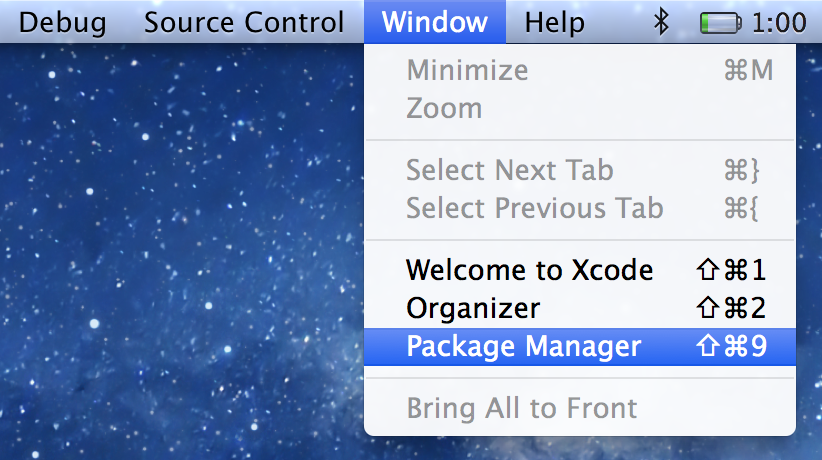

## 插件管理软件推荐[Alcatraz](https://github.com/alcatraz/Alcatraz)

### 安装方法
```
curl -fsSL https://raw.github.com/alcatraz/Alcatraz/master/Scripts/install.sh | sh

# 重启Xcode
```

### 配置方法

第1步



第2步


第3步

输入`asiainfomobile`自定义的插件列表
`https://raw.githubusercontent.com/asiainfomobile/iOS-style-guide/master/assets/plugins.json`

## 一键代码格式化插件
Xcode原生自带的格式化方法只有`CTRL＋I`调整缩进

### Objective-C 代码格式
[BBUncrustifyPlugin](https://github.com/benoitsan/BBUncrustifyPlugin-Xcode)

配置

`Xcode Edit`->`Format Code`->`BBUncrustifyPlugin Preferences` 设置 `Formatter` 成 `Uncrustify`

```
git clone git@github.com:asiainfomobile/uncrustify.git ~/uncrustify
```

### Swift 代码格式

[Swimat](https://github.com/Jintin/Swimat)


### JS HMTL CSS JSON 代码格式

Xcode 自带的JS自动缩进比较难用，所以推荐使用[JSFormatter-Xcode](https://github.com/bumaociyuan/JSFormatter-Xcode)

需要

* [Node.js](https://nodejs.org/)
* [js-beautify](https://github.com/beautify-web/js-beautify)


### 绑定快捷键

对于App没有快捷键和快捷键不符合自己的使用习惯，可以修改快捷键，此方法适用于所有 Mac App

`System Preferences` -> `Keyboard` -> `Shortcuts` -> `App Shortcuts` -> 点击加号新增


## 其他插件
TODO