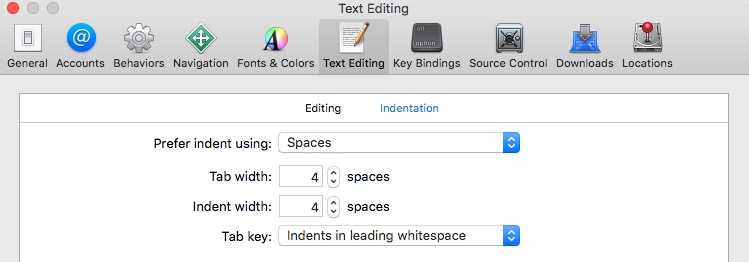

## 空格

* 缩进应该是用4个空格而不是tab，Xcode设置如下图

<!--* Indent using 4 spaces rather than tabs to conserve space and help prevent line wrapping. Be sure to set this preference in Xcode as shown below:-->

  
  
  
## Xcode 工程

为了避免文件杂乱，物理文件应该保持和 Xcode 项目文件同步。Xcode 创建的任何组（group）都必须在文件系统有相应的映射。为了更清晰，代码不仅应该按照类型进行分组，也可以根据功能进行分组。

如果可以的话，尽可能一直打开 target Build Settings 中 "Treat Warnings as Errors" 以及一些[额外的警告][Xcode-project_1]。如果你需要忽略指定的警告,使用 [Clang 的编译特性][Xcode-project_2] 。

[Xcode-project_1]:http://boredzo.org/blog/archives/2009-11-07/warnings

[Xcode-project_2]:http://clang.llvm.org/docs/UsersManual.html#controlling-diagnostics-via-pragmas